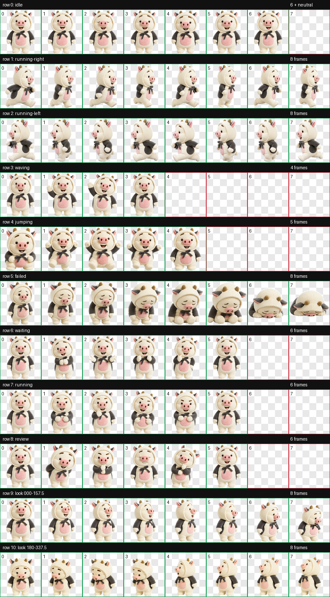

<div align="center">
  

  <h1>猪屁登</h1>

  <p><strong>把这只软乎乎的小猪，带进你的 Codex。</strong></p>
  <p>奶油白的小猪动画宠物 · 9 组状态动画 · 16 个观察方向</p>

  <p>
    <a href="https://github.com/Loki-Tricks/zhu-pi-deng/releases/latest"></a>
    
    
    
    <a href="https://github.com/Loki-Tricks/zhu-pi-deng/actions/workflows/install-test.yml"></a>
  </p>

  <p>
    <a href="#一键安装">一键安装</a> ·
    <a href="#动作预览">动作预览</a> ·
    <a href="#常见问题">常见问题</a> ·
    <a href="https://github.com/Loki-Tricks/zhu-pi-deng/releases/latest">下载最新版</a>
  </p>
</div>

---

## 一键安装

> [!TIP]
> 安装完成后，请重启 Codex，然后在宠物菜单中选择 **猪屁登**。

### Windows

打开 **PowerShell**，粘贴下面一行并回车：

```powershell
irm https://raw.githubusercontent.com/Loki-Tricks/zhu-pi-deng/main/install.ps1 | iex
```

### macOS

打开 **终端**，粘贴下面一行并回车：

```bash
curl -fsSL https://raw.githubusercontent.com/Loki-Tricks/zhu-pi-deng/main/install.sh | bash
```

安装器会先校验宠物包；如果已经装过猪屁登，会自动备份旧版本，不会直接覆盖或删除。

<details>
<summary><strong>不想运行在线命令？下载后安装</strong></summary>

1. 从 [Releases](https://github.com/Loki-Tricks/zhu-pi-deng/releases/latest) 下载源码压缩包并解压。
2. Windows 双击 `install.bat`。
3. macOS 双击 `install.command`；如果系统拦截，请右键文件并选择“打开”。
4. 重启 Codex。

</details>

## 动作预览

| 安静陪伴 | 认真工作 | 热情招手 |
| :---: | :---: | :---: |
|  |  |  |

猪屁登包含完整的 Codex v2 动画状态：待机、左右移动、挥手、跳跃、失败、等待输入、工作中与审阅，以及一整圈 16 向观察动作。

<details>
<summary><strong>查看完整精灵图动作表</strong></summary>

<br />



</details>

## 它有什么

| 项目 | 内容 |
| --- | --- |
| 动画状态 | 9 组标准 Codex 动画 |
| 观察方向 | 顺时针 16 个方向 |
| 宠物格式 | Codex Pet v2 |
| 精灵图集 | `1536 × 2288` WebP，透明背景 |
| 单元格 | `192 × 208`，`8 × 11` 布局 |
| 支持系统 | Windows、macOS |
| 安装保护 | 自动校验，并以时间戳备份已有版本 |

## 手动安装

将 `pet.json` 与 `spritesheet.webp` 一起复制到对应目录：

| 系统 | 安装目录 |
| --- | --- |
| Windows | `%USERPROFILE%\.codex\pets\zhu-pi-deng\` |
| macOS | `~/.codex/pets/zhu-pi-deng/` |

复制完成后重启 Codex。

## 卸载

卸载脚本采用可恢复方式移走宠物文件，不会永久删除。

**Windows**

```powershell
powershell -ExecutionPolicy Bypass -File .\uninstall.ps1
```

**macOS**

```bash
bash uninstall.sh
```

## 常见问题

<details>
<summary><strong>安装后为什么没有看到猪屁登？</strong></summary>

请完全退出并重新打开 Codex，再进入宠物菜单选择“猪屁登”。同时确认 `pet.json` 和 `spritesheet.webp` 位于同一个 `zhu-pi-deng` 目录中。

</details>

<details>
<summary><strong>macOS 提示无法打开 install.command 怎么办？</strong></summary>

优先使用上方的终端一键安装命令。也可以右键 `install.command`，选择“打开”，再确认运行。

</details>

<details>
<summary><strong>重新安装会丢掉旧版本吗？</strong></summary>

不会。安装器会将旧目录改名为 `zhu-pi-deng.backup-日期时间`，需要时可以手动恢复。

</details>

## 致谢与版权

这是一个非官方、非商业的粉丝创作 Codex 宠物。安装与卸载脚本采用 [MIT License](LICENSE)；角色名称、形象及相关视觉资产的权利归其各自权利人所有，MIT License 不适用于这些角色资产。

详细说明见 [NOTICE.md](NOTICE.md)。如果你喜欢猪屁登，欢迎点亮一个 ⭐。

<div align="center">
  <sub>Made with 🐷 by <a href="https://github.com/Loki-Tricks">Loki-Tricks</a></sub>
</div>
